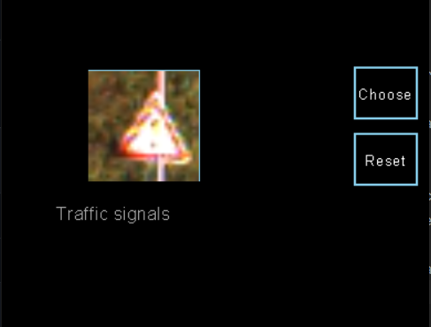
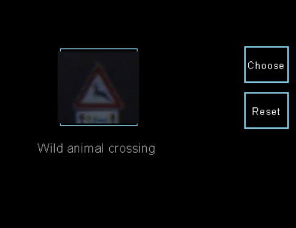

# Functionality
- 
- 

-  (https://youtu.be/N54Y_iZUwXo)

# Explanation:
So, to get a functional model:
First, I created a convolutional neural network structured like this:
- 1 conv2D layer with 32 filters
- A maxPooling2D layer
- A flattening layer
- 1 hidden layer with 128 nodes
- A dropout layer
- And a dense output layer with NUM_CATEGORIES units and `softmax`as activation function

After training and testing, i got a loss of `3.5026` and an accuracy of `0.0547` which are very bad, on the testing dataset.

Then I changed the number of filters of the input layer: 128 but it didn't change the results.

The next change I tried was to remove the dropout: SURPRISE!!! The accuracy on the training dataset increased to 0.9767
But the loss was still too high: `0.6314` on the testing dataset

Next I tried increasing the size of the hidden layer to 256: got loss:`0.5819` and accuracy of `0.9315`

I also tried to change the number and the size of pooling Layers but it didn't significantly change the results:
Losses were still around `0.41` and accuracy was about `0.92` on the testing dataset.

Ultimately, when i added a second convolutional layer of 32 units, the loss dropped to `0.2209` and
accuracy was `0.9652`.
Then I added 4 others convolutional layers of the same size and got a loss of `0.1084` and an accuracy of `0.9781`
AMAZING!!!
I assume this is an acceptable result.

